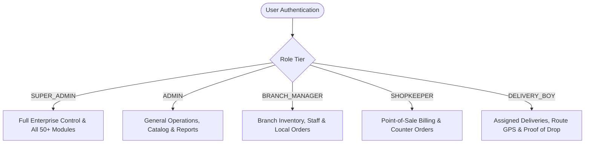

# 🌟 SVK E-Com Pro — Enterprise Super Admin Mobile Suite

<div align="center">


<p align="center">
  <b>A next-generation, high-performance mobile application engineered for multi-branch e-commerce enterprises, executive administration, live inventory logistics, and real-time point-of-sale management.</b>
</p>

[Key Features](#-key-features) • [Architecture](#-architecture--stack) • [Role Access Matrix](#-role-access-matrix) • [50+ Modules Catalog](#-50-enterprise-modules-catalog) • [Getting Started](#-getting-started) • [API & Security](#-security--api-integration)

</div>

---

## 📖 Executive Summary

**SVK E-Com Pro** is a mission-critical mobile application built on top of **React Native 0.86** and **TypeScript**. Designed from the ground up for high concurrency, offline-first reliability, and sub-millisecond tactile responsiveness, it gives enterprise executives, branch managers, shopkeepers, and delivery personnel a single unified pane of glass to orchestrate all commerce operations.

---

## ✨ Key Features

### 👑 1. Enterprise Multi-Role Authentication & Clearance (RBAC)
- **Granular Permission Guards**: Real-time permission evaluation across 5 executive role tiers (`SUPER_ADMIN`, `ADMIN`, `BRANCH_MANAGER`, `SHOPKEEPER`, `DELIVERY_BOY`).
- **Dynamic Role Navigation**: Role-tailored dashboards and navigation trees that automatically adapt according to server authorization matrices.
- **Biometric & Token Security**: Native biometric fingerprint / face unlock, AES-256 local credential caching, and automated JWT refresh interceptors.

### 🎨 2. 3D Avatar Studio & Live Camera Viewfinder
- **Certified 3D Character Engine**:
  - 🎌 **3D Anime & Manga Series**: *Cyber Shinobi*, *Anime Commander*, *Neon Valkyrie*, *Mecha Pilot*, *Mystic Scholar*, *Solar Champion*.
  - 🎨 **3D Cartoon & Pixar Series**: *3D Chief Executive*, *3D Tech Leader*, *3D Operations Boss*, *3D Enterprise Lady*, *3D Cyber Specialist*, *3D Logistics Head*.
- **Interactive Camera Viewfinder**:
  - Full-screen viewfinder overlay with high-visibility target reticles (`#4ADE80`), live lens carousel, flash toggle, and animated shutter snapshot capture.
- **Native Android Permissions**:
  - Android 13+ `READ_MEDIA_IMAGES` & legacy storage permission fallback for secure local media picking.

### 🌓 3. Dual-Engine Luxury Design System
- **Theme Engine**: Seamless real-time switching between **Midnight Obsidian** (Dark Mode) and **Crisp Porcelain** (Light Mode).
- **Responsive Theme Dock**: Full-width segmented dock (`System` / `Light` / `Dark`) with glowing borders, high-contrast iconography, and spring press physics.
- **Floating Glassmorphic Tab Bar**: Curved bottom navigation dock with active capsule indicators, badge counters, and safe-area padding protection.

### 📊 4. Real-Time Commerce & Branch Dashboards
- **Executive KPI Cards**: Real-time gross revenue, sales trends, active order pipelines, inventory health gauges, and low-stock alerts.
- **Multi-Branch Operations**: Real-time branch switcher, localized order queues, employee attendance tracking, and shopkeeper POS reconciliation.
- **Logistics & Delivery Fleet**: Live GPS order tracking, delivery rider assignment, route optimization, and proof-of-delivery barcode capture.

### 🔔 5. Real-Time WebSockets & Audio Notification Engine
- **Socket Connectivity**: Zero-latency WebSocket connectivity displaying live system sync status (`REAL-TIME` / `OFFLINE`).
- **Haptic & Audio Tones**: Custom notification sound suite (*Chime*, *Subtle*, *Alert*, *Bell*, *Mute*) with in-app sound preview.

---

## 🏛 Architecture & Stack

```
SVK-ECOM-PRO/
├── android/                    # Native Android project configuration (SDK 34+, Manifest)
├── ios/                        # Native iOS workspace configuration
├── src/
│   ├── api/                    # Axios client, HTTP interceptors, unified endpoints
│   ├── assets/                 # SVGs, brand assets, app icon logos
│   ├── components/
│   │   ├── buttons/            # Primary, Secondary, IconButton with Spring physics
│   │   ├── common/             # Header, ScreenContainer, Card, Badge, MetricCard
│   │   ├── inputs/             # TextField, SearchField, Switch, DatePicker
│   │   └── navigation/         # SidebarDrawer (50+ modules), FloatingBottomDock
│   ├── config/                 # Environment configs, constants, storage keys
│   ├── features/               # Domain-Driven Feature Modules
│   │   ├── attendance/         # Geofenced attendance & check-in system
│   │   ├── auth/               # Login, session management, biometric unlock
│   │   ├── branches/           # Multi-branch directory, performance & manager assignment
│   │   ├── customers/          # CRM directory, loyalty points, transaction history
│   │   ├── dashboard/          # Super Admin, Branch, Employee, Delivery dashboards
│   │   ├── employees/          # Staff directory, role provisioning, payroll metrics
│   │   ├── menu/               # Dynamic 50+ modules backend menu catalog & router
│   │   ├── notifications/      # Realtime alert inbox, sound tone manager
│   │   ├── orders/             # Order pipeline, status transitions, invoices
│   │   ├── products/           # Catalog management, inventory, barcode scanner
│   │   ├── profile/            # Executive profile hero, avatar studio, theme selector
│   │   └── roleaccess/         # RBAC permission matrix editor & security audit
│   ├── hooks/                  # useRealtimeSocket, useDebounce, usePermission
│   ├── navigation/             # RootNavigator, AuthNavigator, RoleNavigator
│   ├── security/               # PermissionService (Android 13+ Storage, Camera, GPS)
│   ├── store/                  # Zustand global stores (authStore, themeStore, drawerStore)
│   └── theme/                  # Color tokens, typography, HSL lighting palettes
```

### Core Technologies

| Layer | Technology | Purpose |
|---|---|---|
| **Runtime** | React Native `0.86.2` | High-performance native mobile engine |
| **Language** | TypeScript `6.0.3` | Type safety and structured enterprise interfaces |
| **State Management** | Zustand `5.0.14` | Decentralized, persistent state stores |
| **Networking** | Axios `1.19.0` | JWT auth interceptors, auto-retry & offline queuing |
| **Navigation** | React Navigation `7.x` | Stack & Bottom Tab navigators with custom animations |
| **Vector Icons** | Lucide React Native | Modern, ultra-sharp vector iconography |
| **Graphics Engine** | React Native SVG `15.15.4` | Hardware-accelerated radial gradients & vector art |
| **Storage** | Async Storage `2.2.0` | Encrypted offline session and preference caching |

---

## 🛡 Role Access Matrix

The application dynamically renders workspaces according to the authenticated user's role:



| Role | Dashboard | Catalog & Products | Orders & Invoicing | Branch Management | Staff & Payroll | RBAC & Security |
|---|:---:|:---:|:---:|:---:|:---:|:---:|
| **SUPER ADMIN** | 🟢 Full Access | 🟢 Full Access | 🟢 Full Access | 🟢 Full Access | 🟢 Full Access | 🟢 Full Access |
| **ADMIN** | 🟢 Full Access | 🟢 Full Access | 🟢 Full Access | 🟡 Read Only | 🟢 Full Access | 🔴 Restricted |
| **BRANCH MANAGER** | 🔵 Branch Only | 🟢 Stock Sync | 🟢 Branch Orders | 🔵 Assigned Branch | 🔵 Branch Staff | 🔴 Restricted |
| **SHOPKEEPER** | 🟡 POS Terminal | 🟡 Price Check | 🟢 Counter Orders | 🔴 Restricted | 🔴 Restricted | 🔴 Restricted |
| **DELIVERY BOY** | 🟠 Rider Orders | 🔴 Restricted | 🟠 Delivery Only | 🔴 Restricted | 🔴 Restricted | 🔴 Restricted |

---

## 📦 50+ Enterprise Modules Catalog

The sidebar drawer provides instant search across 50+ specialized backend modules:

```
├── 📦 Products & Inventory      ├── 👥 Human Resources & Staff
│   ├── Products Catalog         │   ├── Employees Directory
│   ├── Product Tags             │   ├── Leave Requests
│   ├── Item Variants            │   ├── Duty Schedules
│   ├── Category Hierarchy       │   ├── Tour / Travel Claims
│   ├── Dynamic Attributes       │   ├── Attendance Geofencing
│   └── Multi-Branch Stock       │   ├── Fingerprint Biometrics
│                                │   └── Performance Reviews
├── 🛒 Sales & Orders            │
│   ├── All Orders Pipeline      ├── 🏢 Enterprise Governance
│   ├── Invoices & Billing       │   ├── Branch Locations
│   ├── Credit / Debit Cards     │   ├── Vehicle & Fleet Tracking
│   ├── POS Terminal Mode        │   ├── Radar Geofencing
│   ├── Discount Coupons         │   ├── RBAC Access Matrix
│   └── Delivery Dispatch        │   └── Security Audit Logs
```

---

## 🚀 Getting Started

### Prerequisites

- **Node.js**: `v18.x` or `v20.x` LTS
- **Java Development Kit**: JDK `17`
- **Android Studio**: Android SDK `34+` (API 34 / 35 with build-tools `34.0.0`)
- **React Native CLI**: Latest

### Installation

1. **Clone the Repository**:
   ```bash
   git clone https://github.com/Shandresh-pj/E-Com-Super-Admin.git
   cd E-Com-Super-Admin
   ```

2. **Install Dependencies**:
   ```bash
   npm install
   ```

3. **Start the Metro Bundler**:
   ```bash
   npm run start
   ```

4. **Launch on Android**:
   ```bash
   npm run android
   ```

5. **Launch on iOS (macOS only)**:
   ```bash
   cd ios && pod install && cd ..
   npm run ios
   ```

---

## 🔒 Security & API Integration

### Centralized Axios Client (`src/api/axiosClient.ts`)

```typescript
// Automatic Bearer Token Injection & 401 Interception
axiosClient.interceptors.request.use(async (config) => {
  const token = useAuthStore.getState().token;
  if (token) {
    config.headers.Authorization = `Bearer ${token}`;
  }
  return config;
});
```

### Android Hardware Permissions (`src/security/permissionService.ts`)

All device hardware access is validated at runtime with Android 13+ compatibility:

```typescript
// Camera, Storage, GPS, and Push Notifications
const permissions = await PermissionService.checkAllPermissions();
// Requests READ_MEDIA_IMAGES on Android 13+ and READ_EXTERNAL_STORAGE on Android <= 12
await PermissionService.requestStorage();
await PermissionService.requestCamera();
```

---

## 📱 Release & Build Commands

### Clean Build Cache
```bash
cd android && ./gradlew clean && cd ..
```

### Build Production Release APK
```bash
cd android && ./gradlew assembleRelease
# Output located at: android/app/build/outputs/apk/release/app-release.apk
```

### Build Production Android App Bundle (AAB for Google Play Store)
```bash
cd android && ./gradlew bundleRelease
# Output located at: android/app/build/outputs/bundle/release/app-release.aab
```

---

## 👨‍💻 Author & Maintainer

- **Developer**: [Shandresh P J](https://github.com/Shandresh-pj)
- **Repository**: [E-Com-Super-Admin](https://github.com/Shandresh-pj/E-Com-Super-Admin.git)
- **Organization**: SVK Enterprise Solutions

---

<div align="center">
  <sub>Built with ❤️ for enterprise-scale commerce. Secured with 256-bit RBAC.</sub>
</div>